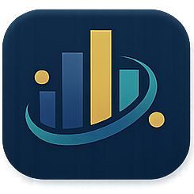

# IMRNNs Website

<p align="center">
  
</p>

<p align="center">
  Official project website for <strong>Interpretable Modular Retrieval Neural Networks (IMRNNs)</strong>
  <br />
  EACL 2026 · Paper · Code · Checkpoints · Interactive method visualization
</p>

<p align="center">
  <a href="https://yashsaxena21.github.io/IMRNNs-web/">Live Website</a> ·
  <a href="https://github.com/YashSaxena21/IMRNNs">GitHub Codebase</a> ·
  <a href="https://huggingface.co/yashsaxena21/IMRNNs">Hugging Face</a> ·
  <a href="https://arxiv.org/abs/2601.20084">Paper</a>
</p>

<p align="center">
  
</p>

## Live Site

The public website is live at:

- `https://yashsaxena21.github.io/IMRNNs-web/`

This site presents the IMRNNs paper, method overview, usage entry points, project links, and an interactive visualization of embedding modulation.

## What This Repository Contains

- The static website for IMRNNs
- Branding and logo assets used by the live site
- The interactive method visualization
- Public entry points to the paper, GitHub implementation, and Hugging Face checkpoints

## Project Links

- Website: `https://yashsaxena21.github.io/IMRNNs-web/`
- Main code repository: `https://github.com/YashSaxena21/IMRNNs`
- Hugging Face release: `https://huggingface.co/yashsaxena21/IMRNNs`
- Paper: `https://arxiv.org/abs/2601.20084`
- Portfolio: `https://yashsaxena21.github.io/Portfolio/`

## Site Highlights

- Hero section with the full IMRNNs expansion and project summary
- Interactive visualization of query-document modulation in embedding space
- Paper section with a copyable BibTeX citation
- Usage section for quick start, training, and custom retriever workflows
- Ecosystem links to code, checkpoints, paper, and lab context

## Visual Identity

The site uses the official project and affiliation marks shown below.

<p>
  
  &nbsp;&nbsp;
  
  &nbsp;&nbsp;
  
  &nbsp;&nbsp;
  
  &nbsp;&nbsp;
  
  &nbsp;&nbsp;
  
</p>

## Repository Layout

```text
IMRNNs-web/
├── index.html
├── styles.css
├── script.js
└── assets/
```

- `index.html`: page structure, metadata, and content
- `styles.css`: full visual system, responsive layout, and animation styling
- `script.js`: tabs, interactive visualization, copy-to-clipboard, and motion controls
- `assets/`: logos, portraits, social card, and supporting site assets

## Local Preview

```bash
cd IMRNNs-web
python3 -m http.server 8000
```

Then open:

- `http://localhost:8000`

## Deployment

This repository is deployed with GitHub Pages and does not require a build step.

To redeploy from GitHub:

1. Push changes to `main`.
2. Open `Settings -> Pages`.
3. Set `Source` to `Deploy from a branch`.
4. Select `main` and `/ (root)`.

## Citation

If you use IMRNNs, cite:

```bibtex
@misc{saxena2026imrnns,
  title={IMRNNs: An Efficient Method for Interpretable Dense Retrieval via Embedding Modulation},
  author={Yash Saxena and Ankur Padia and Kalpa Gunaratna and Manas Gaur},
  year={2026},
  eprint={2601.20084},
  archivePrefix={arXiv},
  note={Accepted to EACL 2026}
}
```
